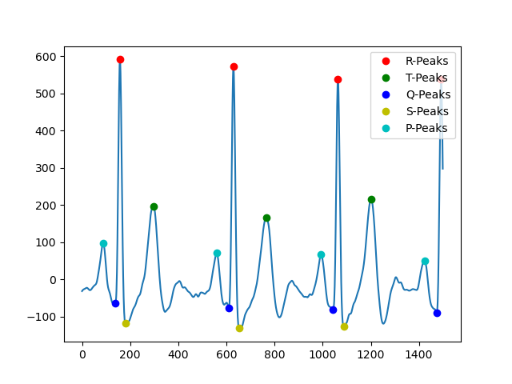
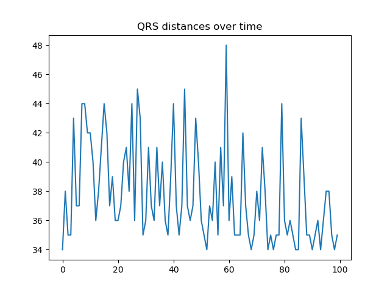

# Data-Extraction-Mindray-Monitor
This repository contains code for extracting data from Mindray monitors, using computer vision and signal processing techniques.
The "Frames" folder contains example frames sampled from a Mindray monitor during an operation.

The "ECGWavePeakDetection" folder gets tabular data from the monitor (500 samples per second) and performs peak detection algorithms with high accuracy and efficient running time to analyze the wave. 

The "NumberRecognition" folder gets video recordings of the monitor and uses computer vision techniques and (optionally) deep learning methods (convolutional neural networks) to invert the monitor measurements to tabular data.

